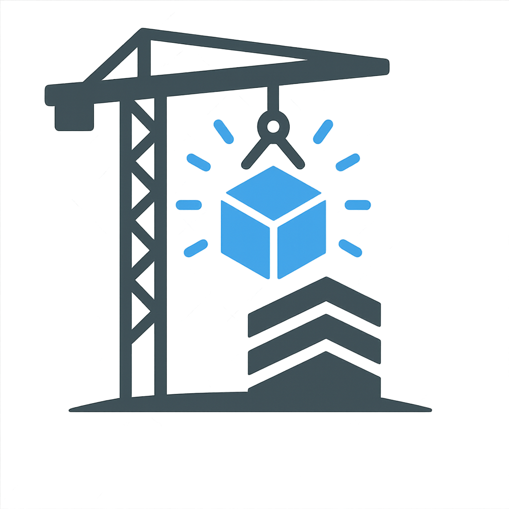

<h1 align="center">
  
  <span style="vertical-align: top; margin-left: 10px;">OpenConstruction Open Science Initiative</span>
</h1>

**OpenConstruction** is a **community-governed, open-source platform** that enables the
**distributed development, validation, and discovery** of datasets, AI models,
workflows, and open educational resources (OERs) for the
Architecture, Engineering, and Construction (AEC) domain.

🌐 Website: https://www.openconstruction.org  
💬 Community: https://github.com/ruoxinx/open-construction/discussions  
📧 Contact: support@openconstruction.org  


## Purpose

AI-ready resources in the AEC domain are often fragmented, inconsistently documented,
and difficult to reuse. OpenConstruction provides
**shared infrastructure, standards, and workflows** that support:

- Discoverability and comparison of AEC AI resources  
- Reproducible research and benchmarking  
- Community stewardship and long-term maintenance  
- Continuous, distributed platform development  

OpenConstruction **does not host datasets or models**. It indexes publicly available
resources and focuses on the **platform and standards** that make them reusable,
interoperable, and sustainable.


## Semantic Interoperability

OpenConstruction is developing an ontology layer for harmonizing
inconsistent dataset labels across the AEC domain.

The intended architecture is:

- `ontology/*.ttl` for canonical concepts and concept hierarchy
- `site/data/object-label-mappings.json` for dataset-specific raw-label mappings
- website taxonomies and vocabularies as derived presentation artifacts

See [ontology/GOVERNANCE.md](ontology/GOVERNANCE.md) for modeling rules and review guidance.


## Contribution Model
OpenConstruction follows a **distributed development model**. Anyone may participate by proposing contributions, reviewing changes, and helping
maintain both **the cataloged resources** and **the platform infrastructure**.

### Ways to Contribute

You can contribute by:
- Adding or updating dataset, model, workflow, or OER entries
- Improving metadata schemas or validation scripts
- Developing platform modules (ingestion helpers, evaluators, benchmarks)
- Improving documentation, tooling, or onboarding materials

👉 See **[CONTRIBUTING.md](CONTRIBUTING.md)** for detailed contribution instructions.

## How to Contribute

1. Open an issue using the appropriate template.
2. Fork the repository and create a feature branch.
3. Add or modify files following schema and contribution standards.
4. Submit a pull request (PR) describing your changes.
5. Address review feedback; once approved, the PR is merged and credited.

All contributions undergo **peer review** and **automated CI checks**.


## Continuous Integration & Quality Assurance

All pull requests are validated through **CI/CD workflows**, including:
- JSON schema validation  
- Required metadata field checks  
- Lightweight link validation  
- Attribution and license checks  


## Modular Extension System

OpenConstruction supports **community-maintained modules** that extend platform
capabilities.

Example module types include:
- Benchmark definitions and task packs
- Validation and enrichment utilities


## Governance & Stewardship

The OpenConstruction ecosystem is sustained through **open, rotating,
community-driven roles**, including:

- **Core Maintainers** – platform-wide stewardship and governance
- **Module Maintainers** – oversight of specific catalogs or modules
- **Stewards & Reviewers** – quality assurance and contributor mentoring
- **Release Leads** – coordination of periodic releases and changelogs
- **Community Contributors** – anyone participating in development or review

👉 See **[GOVERNANCE.md](GOVERNANCE.md)** for full governance details.
Community participation is also guided by **[CODE_OF_CONDUCT.md](CODE_OF_CONDUCT.md)** and **[SECURITY.md](SECURITY.md)**.


## Rights & License

**Copyright (c) 2024-2026 OpenConstruction Open Science Initiative**

The website source code, JavaScript/TypeScript SDK (`@openconstruction/api`), JSON schemas, and validation scripts are licensed under the **[Apache License 2.0](LICENSE)**. See the [NOTICE](NOTICE) file for full attribution.

**How to attribute this project in derivative works:**
> OpenConstruction Open Science Initiative. *OpenConstruction* [Software]. Available at: https://github.com/ruoxinx/open-construction. Licensed under Apache 2.0.

**Academic use:** If you use OpenConstruction in research, please cite the associated peer-reviewed publication (see [Citation](#citation) below). A machine-readable [CITATION.cff](CITATION.cff) is also provided — GitHub will show a "Cite this repository" button automatically.

**Catalog data:** Metadata entries in `site/data/` are contributed by the community and attributed to their respective authors. All catalog entries must include a valid open license as a condition of contribution.

**Images and thumbnails:** Images in `site/assets/img/` are © their respective creators unless otherwise noted. OpenConstruction respects all intellectual property and does not redistribute restricted or proprietary content.

## Citation

If OpenConstruction is helpful in your research, you may cite:
*Xiong, R., Wang, Y., Cai, J., Liu, K., Zhu, Y., Tang, P., El-Gohary, N., and Gibson Jr, G. E. (2026).* "Toward open science in the AEC community: An ecosystem for sustainable digital assets sharing and reuse." *Developments in the Built Environment*, 26, 100909. [https://doi.org/10.1016/j.dibe.2026.100909](https://doi.org/10.1016/j.dibe.2026.100909)

```bibtex
@article{xiong2026toward,
  title={Toward open science in the AEC community: An ecosystem for sustainable digital assets sharing and reuse},
  author={Xiong, Ruoxin and Wang, Yanyu and Cai, Jiannan and Liu, Kaijian and Zhu, Yuansheng and Tang, Pingbo and El-Gohary, Nora and Gibson Jr, George Edward},
  journal={Developments in the Built Environment},
  volume={26},
  pages={100909},
  year={2026},
  publisher={Elsevier}
}
```


## Acknowledgment
<p>
  
</p>

OpenConstruction is supported by the **U.S. National Science Foundation** under
[Award No. 2612086](https://www.nsf.gov/awardsearch/show-award?AWD_ID=2612086).

We thank the global community of researchers, educators, and practitioners whose
contributions advance open science and AI innovation in the AEC domain.
